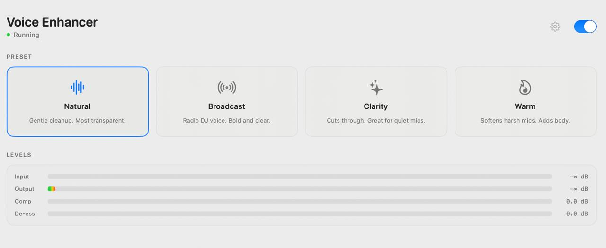

<div align="center">


# Voice Enhancer

**Real-time voice processing for macOS meetings.**

Sounds better on every call — no knobs required.

[](LICENSE)
[](https://www.apple.com/macos/)
[](#)

<br>

*Voice Enhancer captures your microphone, processes it through a professional DSP chain, and exposes the result as a virtual microphone. Zoom, Teams, Meet, Discord, OBS — any app — just selects "Voice Enhancer" as the mic.*

<br>



</div>

<br>

## How It Works

<div align="center">

</div>

<br>

Your voice goes in raw, comes out polished. Meeting apps see "Voice Enhancer" as a regular microphone — no plugins, no extensions, no per-app setup.

## Features

🎛 **4 Voice Presets** — Natural, Broadcast, Clarity, Warm. One click to sound great.

🎚 **Live Tuning** — Adjustable compression and de-essing sliders. Dial in exactly what works for your voice.

🎤 **Voice Preview** — Record a 3-second clip, then adjust sliders and hear the effect on your own voice instantly. No need to be on a call to test.

📊 **Real-Time Meters** — Input/output levels plus compressor and de-esser gain reduction. See what the DSP is doing.

🔌 **Virtual Microphone** — Shows up as "Voice Enhancer" in any app's mic picker. Works everywhere.

⚡ **Low Latency** — ~10ms processing. No perceptible delay.

🔒 **Privacy First** — All processing is local. No network calls. No telemetry. No cloud. No AI.

## Presets

| Preset | Character | Best For |
|--------|-----------|----------|
| **Natural** | Gentle cleanup, transparent | Good mics, quiet rooms |
| **Broadcast** | Radio DJ voice, bold and clear | Podcasts, presentations |
| **Clarity** | Presence boost, cuts through noise | Quiet or distant mics |
| **Warm** | Adds body, softens harshness | Thin or harsh-sounding mics |

## Installation

### Homebrew (recommended)

```sh
brew tap aheadly-tech/tap
brew install --cask voice-enhancer
```

This installs the app to `/Applications` and the virtual audio driver to the system. You'll be prompted for your password to install the driver.

### After install

1. Open **Voice Enhancer**
2. Grant microphone permission when prompted
3. Pick a preset
4. In your meeting app, select **"Voice Enhancer"** as the microphone
5. That's it

### Uninstall

```sh
brew uninstall --cask voice-enhancer
```

### Build from source

<details>
<summary>For contributors and developers</summary>

**Prerequisites:** Xcode 15+, CMake 3.20+, [XcodeGen](https://github.com/yonaskolb/XcodeGen)

```sh
brew install cmake xcodegen
./scripts/build.sh
sudo ./scripts/install.sh
open VoiceEnhancerApp/build/Build/Products/Release/Voice\ Enhancer.app
```

To uninstall a source build: `sudo ./scripts/uninstall.sh`

</details>

## Architecture

Three components, cleanly separated:

| Component | Language | Role |
|-----------|----------|------|
| **AudioEngine** | C++17 | DSP library — HPF, compressor, parametric EQ, de-esser, limiter. RT-safe, unit-tested. |
| **VirtualDriver** | C++ | Core Audio HAL plugin. Registers as a system microphone. |
| **VoiceEnhancerApp** | Swift / SwiftUI | User interface, mic capture, parameter control. Talks to engine via C ABI. |

**IPC:** App and driver share audio through a POSIX shared-memory lock-free SPSC ring buffer ([`shared/RingBuffer.h`](shared/RingBuffer.h)). No XPC, no kext, no IPC frameworks.

<details>
<summary><b>Repository layout</b></summary>

```
├── AudioEngine/             C++ DSP library (CMake)
│   ├── include/             Public headers
│   ├── src/                 Implementation
│   ├── bridge/              C ABI for Swift interop
│   └── tests/               Unit tests
├── VirtualDriver/           Core Audio HAL plugin
│   └── src/                 Plugin, Device, Stream implementations
├── VoiceEnhancerApp/        SwiftUI macOS application
│   └── Sources/
│       ├── App/             App entry point
│       ├── Audio/           Mic capture, engine bridge, voice preview
│       ├── Models/          Preset, AudioDevice
│       ├── ViewModels/      AudioViewModel
│       ├── Views/           ContentView, Settings, Meters, Presets
│       └── Resources/       Assets, entitlements, Info.plist
├── shared/                  Ring buffer (shared by app + driver)
├── scripts/                 Build, install, notarize, uninstall
└── docs/                    Architecture, build guide, contributing
```

</details>

## Performance

The audio callback is engineered for real-time safety:

- **Fast math** — IEEE 754 bit-trick approximations replace per-sample transcendental functions (~3.8× faster DSP than naive `std::log10`/`std::exp`)
- **Zero allocations** — No `malloc`, no locks, no Swift runtime calls on the audio thread
- **Engine-managed conversion** — AVAudioEngine handles sample rate conversion in its own RT-optimized graph
- **Large ring buffer** — 16,384 frames (~341ms at 48 kHz) absorbs macOS scheduling jitter without underruns

## FAQ

<details>
<summary><b>"Voice Enhancer" doesn't show up as a microphone</b></summary>

The HAL driver needs to be installed:

```sh
sudo ./scripts/install.sh
```

This copies the driver to `/Library/Audio/Plug-Ins/HAL/` and restarts `coreaudiod`. You may hear a brief audio interruption — that's normal.

</details>

<details>
<summary><b>Can I use this during a live call?</b></summary>

Yes. The app processes audio continuously. You can change presets and adjust sliders mid-call. The Voice Preview feature (record → play back) outputs to your speakers/headphones, not the virtual mic, so it won't leak into the meeting.

</details>

<details>
<summary><b>Does this work with AirPods / Bluetooth mics?</b></summary>

Yes. Voice Enhancer reads from whatever input device you select (or the system default). If macOS sees it as a microphone, Voice Enhancer can process it.

</details>

<details>
<summary><b>What's the CPU usage?</b></summary>

Negligible. The DSP chain processes 512 frames (~10ms) in under 50μs on Apple Silicon. You won't see it in Activity Monitor.

</details>

## Contributing

Issues and pull requests are welcome. Please read [docs/CONTRIBUTING.md](docs/CONTRIBUTING.md) and [docs/ARCHITECTURE.md](docs/ARCHITECTURE.md) first.

## License

[Apache 2.0](LICENSE) — use it, fork it, ship it. Just give credit and note your changes.
