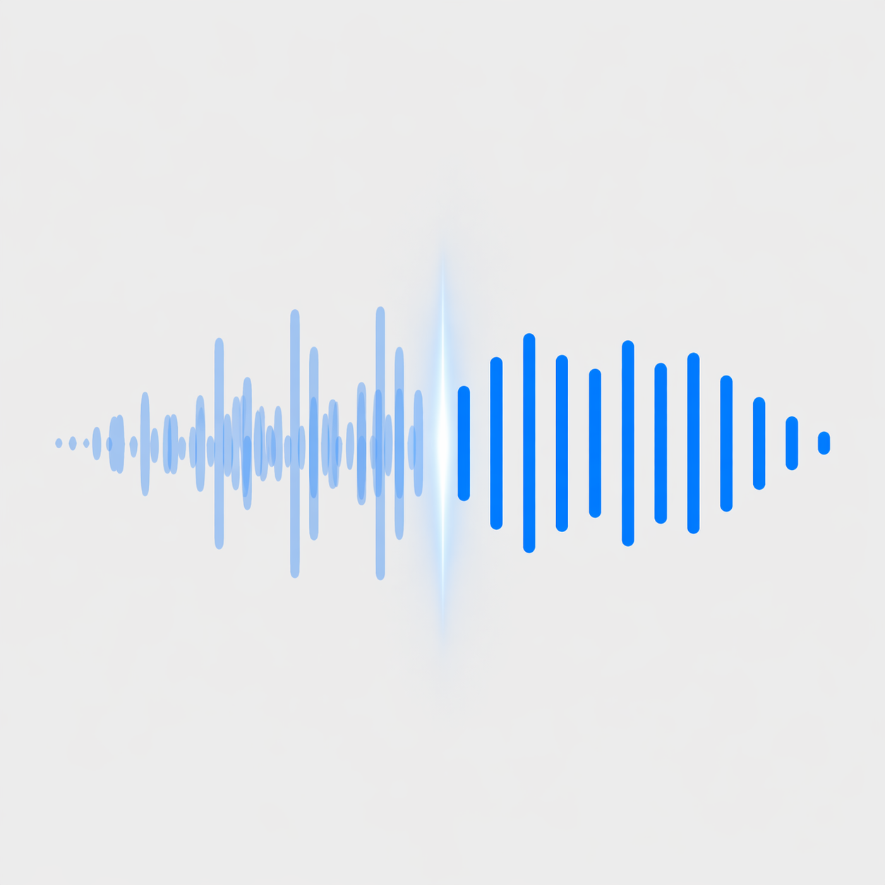
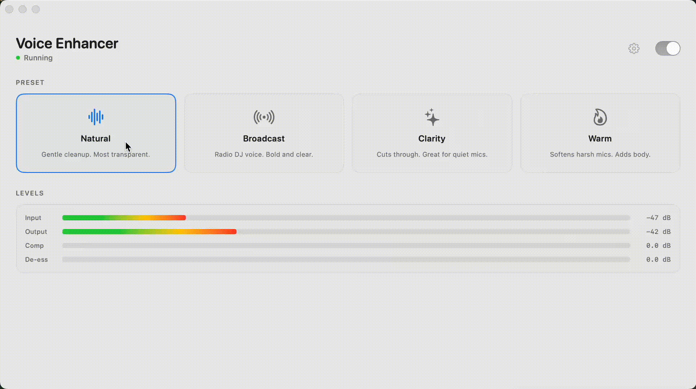
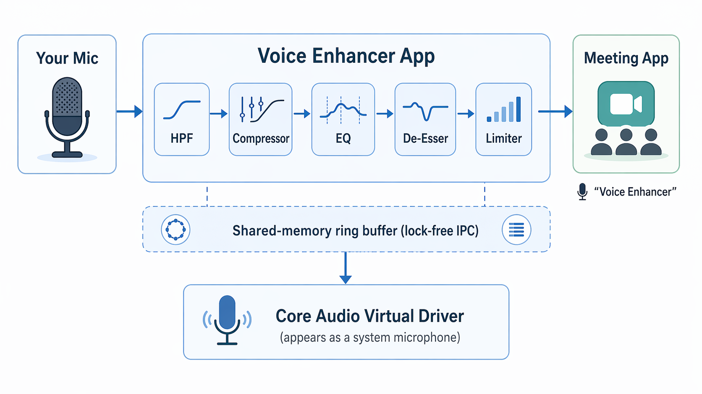

<div align="center">



<br><br>

# Voice Enhancer

### Sound like a pro on every call.

[](LICENSE)
[](https://www.apple.com/macos/)
[](#)
[](#performance)
[](https://soundcloud.com/aheadly-tech/sets/voice-enhander)

<br>

A real-time voice processor for macOS that turns your microphone into a broadcast-quality virtual mic.<br>
**Zoom, Teams, Meet, Discord, OBS** — just pick *"Voice Enhancer"* and talk.

<br>



</div>

<br>

---

<br>

## Why Voice Enhancer?

Most people sound **flat, muddy, or harsh** on calls — not because of bad mics, but because raw audio isn't processed. Voice Enhancer fixes that in real time, with zero setup:

<table>
<tr>
<td width="50%" valign="top">

**Without Voice Enhancer**
- Thin, distant-sounding voice
- Background hum and rumble
- Harsh sibilance ("s" sounds that bite)
- Volume jumps when you lean in or away

</td>
<td width="50%" valign="top">

**With Voice Enhancer**
- Full, present, broadcast-quality voice
- Clean low-end, no rumble
- Smooth, de-essed highs
- Consistent volume, always audible

</td>
</tr>
</table>

<br>

## Features

| | Feature | Description |
|:---:|---|---|
| **4** | **Voice Presets** | Natural, Broadcast, Clarity, Warm — one click to sound great |
| **~10ms** | **Latency** | Real-time processing with no perceptible delay |
| **0%** | **CPU Impact** | 512 frames processed in under 50μs on Apple Silicon |
| **100%** | **Local** | No cloud, no network calls, no telemetry, no AI — your voice stays on your Mac |

<br>

**Live Tuning** — Adjustable compression and de-essing sliders. Dial in exactly what works for your voice, mid-call.

**Voice Preview** — Record a 3-second clip, tweak the sliders, hear the result on your own voice instantly.

**Real-Time Meters** — Input/output levels plus compressor and de-esser gain reduction, so you can see exactly what the DSP is doing.

**Virtual Microphone** — Shows up as *"Voice Enhancer"* in any app's mic picker. No plugins, no extensions, no per-app config.

<br>

## Presets

<table>
<tr>
<td align="center" width="25%">
<br>
<h3>Natural</h3>
<em>Gentle cleanup, transparent</em>
<br><br>
Good mics, quiet rooms
<br><br>
</td>
<td align="center" width="25%">
<br>
<h3>Broadcast</h3>
<em>Radio DJ voice, bold and clear</em>
<br><br>
Podcasts, presentations
<br><br>
</td>
<td align="center" width="25%">
<br>
<h3>Clarity</h3>
<em>Presence boost, cuts through</em>
<br><br>
Quiet or distant mics
<br><br>
</td>
<td align="center" width="25%">
<br>
<h3>Warm</h3>
<em>Adds body, softens harshness</em>
<br><br>
Thin or harsh-sounding mics
<br><br>
</td>
</tr>
</table>

<br>

## Hear the Difference

Same voice, same mic — just a different preset. Listen for yourself:

**[Listen on SoundCloud](https://soundcloud.com/aheadly-tech/sets/voice-enhander)** — Original (unprocessed) vs. Natural, Broadcast, Clarity, and Warm.

<br>

---

<br>

## Quick Start

### Install via Homebrew

```sh
brew tap aheadly-tech/tap
brew install --cask voice-enhancer
```

### Use it

1. Open **Voice Enhancer**
2. Grant microphone permission when prompted
3. Pick a preset
4. In your meeting app, select **"Voice Enhancer"** as the microphone
5. That's it — you sound better now

### Uninstall

```sh
brew uninstall --cask voice-enhancer
```

<details>
<summary><strong>Build from source</strong></summary>

<br>

**Prerequisites:** Xcode 15+, CMake 3.20+, [XcodeGen](https://github.com/yonaskolb/XcodeGen)

```sh
brew install cmake xcodegen
./scripts/build.sh
sudo ./scripts/install.sh
open VoiceEnhancerApp/build/Build/Products/Release/Voice\ Enhancer.app
```

To uninstall a source build: `sudo ./scripts/uninstall.sh`

</details>

<br>

---

<br>

## How It Works

<div align="center">

</div>

<br>

Your voice goes in raw, comes out polished. The DSP chain runs in this order:

```
Mic Input → High-Pass Filter → Compressor → 4-Band Parametric EQ → De-Esser → Limiter → Virtual Mic Output
```

The app and virtual driver communicate through a **lock-free shared-memory ring buffer** — no XPC, no kernel extensions, no IPC frameworks. Just fast, direct memory.

<br>

## Architecture

Three components, cleanly separated:

| Component | Language | Role |
|:---|:---:|:---|
| **AudioEngine** | C++17 | DSP library — HPF, compressor, parametric EQ, de-esser, limiter. Real-time safe, unit-tested. |
| **VirtualDriver** | C++ | Core Audio HAL plugin. Registers as a system microphone. |
| **VoiceEnhancerApp** | Swift / SwiftUI | User interface, mic capture, parameter control. Talks to engine via C ABI. |

**IPC:** App and driver share audio through a POSIX shared-memory lock-free SPSC ring buffer ([`shared/RingBuffer.h`](shared/RingBuffer.h)).

<details>
<summary><strong>Repository layout</strong></summary>

<br>

```
├── AudioEngine/             C++ DSP library (CMake)
│   ├── include/             Public headers
│   ├── src/                 Implementation
│   ├── bridge/              C ABI for Swift interop
│   └── tests/               Unit tests
├── VirtualDriver/           Core Audio HAL plugin
│   └── src/                 Plugin, Device, Stream implementations
├── VoiceEnhancerApp/        SwiftUI macOS application
│   └── Sources/
│       ├── App/             App entry point
│       ├── Audio/           Mic capture, engine bridge, voice preview
│       ├── Models/          Preset, AudioDevice
│       ├── ViewModels/      AudioViewModel
│       ├── Views/           ContentView, Settings, Meters, Presets
│       └── Resources/       Assets, entitlements, Info.plist
├── shared/                  Ring buffer (shared by app + driver)
├── scripts/                 Build, install, notarize, uninstall
└── docs/                    Architecture, build guide, contributing
```

</details>

<br>

## Performance

The audio callback is engineered for **absolute real-time safety**:

- **Fast math** — IEEE 754 bit-trick approximations replace per-sample transcendental functions (~3.8x faster than `std::log10`/`std::exp`)
- **Zero allocations** — No `malloc`, no locks, no Swift runtime calls on the audio thread
- **Engine-managed conversion** — AVAudioEngine handles sample rate conversion in its own RT-optimized graph
- **Large ring buffer** — 16,384 frames (~341ms at 48 kHz) absorbs macOS scheduling jitter without underruns

<br>

---

<br>

## FAQ

<details>
<summary><strong>"Voice Enhancer" doesn't show up as a microphone</strong></summary>

<br>

The HAL driver needs to be installed:

```sh
sudo ./scripts/install.sh
```

This copies the driver to `/Library/Audio/Plug-Ins/HAL/` and restarts `coreaudiod`. You may hear a brief audio interruption — that's normal.

</details>

<details>
<summary><strong>Can I use this during a live call?</strong></summary>

<br>

Yes. The app processes audio continuously. You can change presets and adjust sliders mid-call. The Voice Preview feature outputs to your speakers/headphones, not the virtual mic, so it won't leak into the meeting.

</details>

<details>
<summary><strong>Does this work with AirPods / Bluetooth mics?</strong></summary>

<br>

Yes. Voice Enhancer reads from whatever input device you select (or the system default). If macOS sees it as a microphone, Voice Enhancer can process it.

</details>

<details>
<summary><strong>What's the CPU usage?</strong></summary>

<br>

Negligible. The DSP chain processes 512 frames (~10ms) in under 50μs on Apple Silicon. You won't see it in Activity Monitor.

</details>

<br>

---

<br>

## Contributing

Issues and pull requests are welcome. Please read [docs/CONTRIBUTING.md](docs/CONTRIBUTING.md) and [docs/ARCHITECTURE.md](docs/ARCHITECTURE.md) first.

<br>

## Privacy

[Privacy Policy](PRIVACY.md) — Voice Enhancer runs 100% offline. No data collection, no telemetry, no network calls.

## License

[Apache 2.0](LICENSE) — use it, fork it, ship it. Just give credit and note your changes.

<br>

<div align="center">

---

<br>

**Built by [Aheadly Tech](https://github.com/aheadly-tech)**

*Stop sounding like a webcam mic. Start sounding like a studio.*

<br>

</div>
